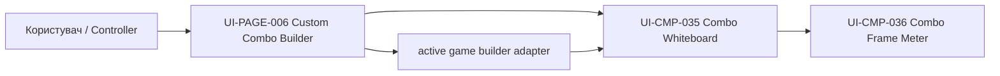
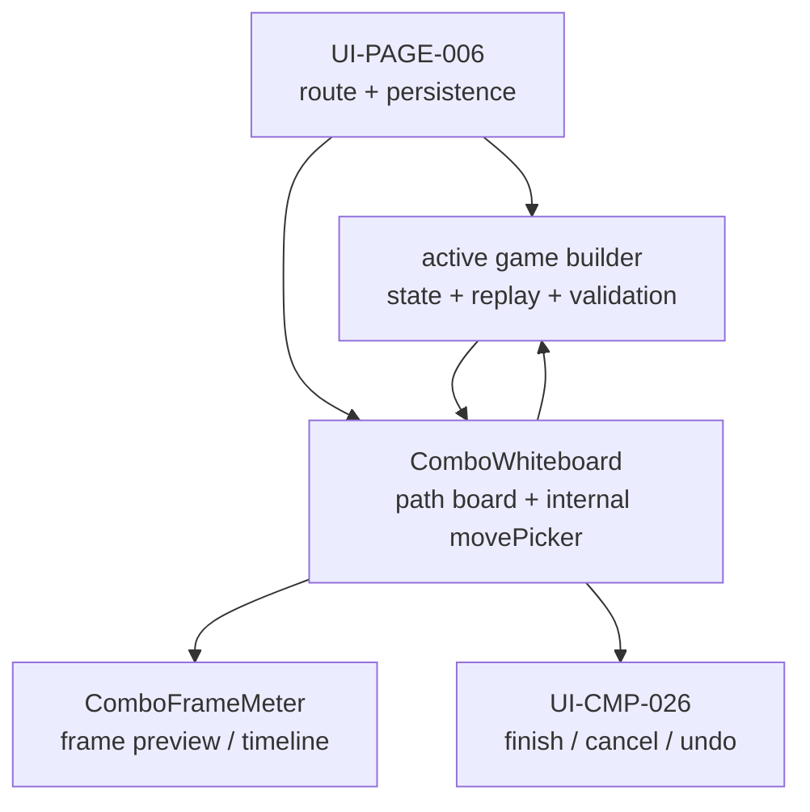
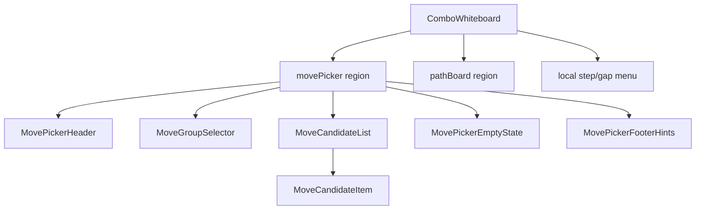
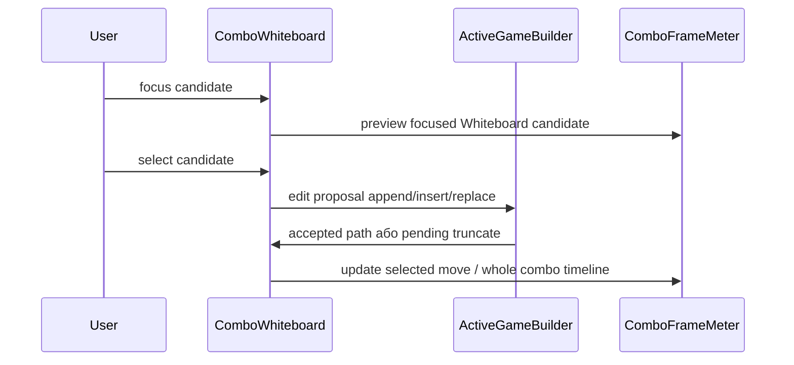

# UI-CMP-035: Combo Whiteboard

## Метадані

- Код: `UI-CMP-035`
- Назва: `Combo Whiteboard`
- Тип: `компонент`
- Статус деталізації: `Описано`
- Батьківська мапа: [UI.md](../UI.md)
- Батьківські поверхні: `UI-PAGE-004 Combo Detail`, `UI-PAGE-006 Custom Combo Builder`
- Замінює active usage: `UI-CMP-016 Move Path Viewer`, `UI-CMP-025 Combo Path Preview`
- Об'єднує active usage: `UI-CMP-024 Move Picker` як deprecated/merged reference; active picker behavior є внутрішнім `movePicker` region цього компонента
- Пов'язані компоненти: [`UI-CMP-015 Notation Renderer`](./UI-CMP-015.md), `UI-CMP-036 Combo Frame Meter`
- Пов'язані UX сценарії: `US-007`, `US-013`, `US-014`, `US-015`, `US-016`, `US-020`, `US-025`

## Призначення

`UI-CMP-035 Combo Whiteboard` показує selected combo path як робочу послідовність moves, gaps, runtime summary, invalid markers і внутрішній `movePicker` region для вибору valid next moves.

`MovePicker` більше не існує як окремий active компонент, public API або page-level focus zone. `UI-CMP-024` лишається тільки deprecated/merged reference, а вся активна поведінка вибору move живе всередині `UI-CMP-035`.

Компонент має два основні режими:

- `builderEditable`: editable workspace у `UI-PAGE-006 Custom Combo Builder`;
- `detailReadOnly`: read-only inspection у `UI-PAGE-004 Combo Detail`.

У builder mode whiteboard не є source of truth. Він рендерить path board і внутрішній `movePicker`, емітить edit proposals, а active game builder adapter replay-ить proposed path, оновлює `movePath`, `cachedNotation`, runtime state, valid next moves, invalid reasons і pending truncate state.

У detail mode whiteboard не емітить mutation events. Він дозволяє step focus і inspection, але edit або duplicate запускаються тільки через page-level actions.

Whiteboard синхронізує focused step або focused move candidate із `UI-CMP-036 Combo Frame Meter`, щоб Frame Meter міг показати `selectedMove`. Якщо Frame Meter просить сфокусувати matching whiteboard step, Whiteboard оновлює тільки presentation focus і не змінює `movePath`.

## Володіння

`UI-CMP-035` є доменним компонентом `@mk-combos/builder-ui`, який може рендеритися builder і detail поверхнями.

Власники стану:

- active game builder adapter володіє active builder path, replay, validation, invalid reasons і accepted/truncated state;
- `UI-PAGE-006` володіє routing, persistence, cancel/save confirmation і page-level dialogs;
- `UI-PAGE-004` володіє detail context, actions menu і read-only combo data;
- `useComboWhiteboardModel` викликається на рівні page flow і готує presentation focus, focused move candidate, selected move group, local menu open state і temporary pick up/drop gesture state;
- `UI-CMP-035` рендерить prepared whiteboard model і емітить semantic edit/focus intents.

Пара module exports:

- hook: `useComboWhiteboardModel`;
- pure UI component: `ComboWhiteboard` / `UI-CMP-035`.

Виклик hook-а належить `UI-PAGE-006` або `UI-PAGE-004`; pure UI component не імпортує builder adapter, route state, persistence або game packages напряму.

Компонент не має:

- самостійно мутувати `movePath`;
- самостійно писати `cachedNotation`;
- зберігати custom combo;
- змінювати seeded combo data;
- виконувати graph validation без active game builder adapter.

## Анатомія

Розміщення whiteboard є робочою ділянкою builder workspace: path board є основною ділянкою, internal `movePicker` стоїть праворуч на широкому екрані або нижче path board на compact, а markers/confirmations прив'язані до відповідної ділянки path або candidate.

```jsx
<ComboWhiteboard ui="UI-CMP-035">
  <WhiteboardSurface slot="builder workspace">
    <Stack name="WhiteboardLayout">
      <RuntimeSummaryStrip />

      <Show when={isWide13_6Plus}>
        <Group name="WhiteboardWorkspace">
          <PathBoardRegion>
            <StepTargetList>
              <MoveStep />
            </StepTargetList>

            <GapTargetList>
              <InsertReorderGap />
            </GapTargetList>

            <Show when={hasInvalidBoundaryMarker}>
              <InvalidBoundaryMarker />
            </Show>

            <Show when={hasLocalStepGapActionMenu}>
              <LocalStepGapActionMenuSlot />
            </Show>
          </PathBoardRegion>

          <InternalMovePickerRegion>
            <Stack name="InternalMovePickerLayout">
              <MoveGroupSelector />

              <CandidateList>
                <MoveCandidate />
              </CandidateList>

              <Show when={hasCandidateDisabledReasonDetails}>
                <CandidateDisabledReasonDetailsSlot />
              </Show>
            </Stack>
          </InternalMovePickerRegion>
        </Group>
      </Show>

      <Show when={isCompact}>
        <Stack name="WhiteboardWorkspace">
          <PathBoardRegion>
            <StepTargetList>
              <MoveStep />
            </StepTargetList>

            <GapTargetList>
              <InsertReorderGap />
            </GapTargetList>

            <Show when={hasInvalidBoundaryMarker}>
              <InvalidBoundaryMarker />
            </Show>

            <Show when={hasLocalStepGapActionMenu}>
              <LocalStepGapActionMenuSlot />
            </Show>
          </PathBoardRegion>

          <InternalMovePickerRegion>
            <Stack name="InternalMovePickerLayout">
              <MoveGroupSelector />

              <CandidateList>
                <MoveCandidate />
              </CandidateList>

              <Show when={hasCandidateDisabledReasonDetails}>
                <CandidateDisabledReasonDetailsSlot />
              </Show>
            </Stack>
          </InternalMovePickerRegion>
        </Stack>
      </Show>

      <Show when={hasPendingTruncateConfirmation}>
        <PendingTruncateConfirmationRegion />
      </Show>

      <Show when={hasRepairStaleMarker}>
        <RepairStaleMarkerRegion />
      </Show>
    </Stack>
  </WhiteboardSurface>
</ComboWhiteboard>
```

Правила розміщення:

- Path board є основною ділянкою і завжди передує internal `movePicker` у порядку читання.
- Step targets і gap targets чергуються всередині path board; invalid boundary marker стоїть біля відповідної boundary, а не в global status area.
- На `wide13_6Plus` `movePicker` може бути правою sibling region; на `compact` він іде нижче path board.
- Presentation focus, local menu state, selected move group і temporary pick up/drop gesture state готує `useComboWhiteboardModel`, який page component викликає на page рівні.

## Вхідні дані

- `mode`: `emptyActive`, `builderEditable`, `detailReadOnly`, `lockedPreview`, `repairReview`, `pendingTruncate` або `savingFrozen`;
- `movePath`;
- `cachedNotation`;
- notation display mode;
- selected або focused step id/index;
- selected gap id/index для insert target;
- valid next moves і optional disabled candidates із readable reasons;
- move groups і selected group id, якщо graph повертає групування;
- focused move candidate id, якщо candidate focus активний у внутрішньому `movePicker`;
- current builder target mode: append, insert, replace або reorder, якщо mode це підтримує;
- runtime summary: meter, damage estimate, position, stance, player state, opponent state і frame context;
- stage context і used interactables, якщо combo stage-specific;
- valid prefix, invalid tail і invalid boundary, якщо path stale або edit proposal truncated;
- pending truncate confirmation state;
- disabled або readonly reasons;
- controller navigation focus state.

## Вихідні події

У всіх modes:

- `requestFocusStep(payload)`;
- `requestFocusGap(payload)`;
- `requestFocusMoveCandidate(payload)` у внутрішньому `movePicker`, якщо mode підтримує builder interaction;
- `requestSyncFocusedStepToFrameMeter(payload)`;
- `requestPreviewFocusedMoveCandidate(payload)`;
- `requestOpenStepDetails(payload)`;
- `requestCloseLocalMenu(payload)`.

Тільки у `builderEditable`:

- `requestSelectMoveCandidate(payload)`;
- `requestMoveToNextGroup(payload)` або `requestMoveToPreviousGroup(payload)`;
- `requestCandidateDetails(payload)`, якщо page-level details підтримані;
- `requestAppendSelectedCandidate(payload)`;
- `requestInsertSelectedCandidate(payload)`;
- `requestReplaceFocusedStep(payload)`;
- `requestRemoveFocusedStep(payload)`;
- `requestUndoToFocusedStep(payload)`;
- `requestPickUpFocusedStep(payload)`;
- `requestDropPickedStep(payload)`;
- `requestConfirmTruncate(payload)`;
- `requestCancelTruncate(payload)`.

- `requestRepairFromValidPrefix(payload)`.

Тільки у `detailReadOnly`:

- `requestEditCustomCombo(payload)`;
- `requestDuplicateSeededCombo(payload)`, якщо detail action це дозволяє.

Output payloads містять step/gap/candidate ids, mode, reason і source focus target. Component не передає browser event objects у page-level handlers.

## C4 структура internal `movePicker`

### C4-L1: System Context



- Користувач вибирає move не в окремому picker surface, а всередині Whiteboard.
- `UI-PAGE-006` координує route, persistence і dialogs, але не рендерить `MovePicker` як sibling.
- Active game builder adapter лишається source of truth для graph, valid next moves, replay і validation.
- `Combo Frame Meter` отримує preview від focused Whiteboard candidate.

### C4-L2: Containers / Ownership



- `UI-PAGE-006` передає у Whiteboard builder state, valid next moves, current target, saving/loading/error states.
- `useComboWhiteboardModel` готує presentation focus: candidate focus, step focus, gap focus, local menu, pick up/drop.
- Active game builder adapter приймає edit proposals і повертає accepted path або pending truncate.
- `ComboFrameMeter` читає focused Whiteboard step або focused Whiteboard candidate.

### C4-L3: Component Structure



#### `movePicker region`

Внутрішній регіон Whiteboard, який показується тільки в builder-capable modes:

- `emptyActive`;
- `builderEditable`;
- `pendingTruncate`;
- `repairReview`;
- `savingFrozen` як disabled/frozen view.

У `detailReadOnly` цей регіон не рендериться.

#### `MovePickerHeader`

Показує:

- active target: `append`, `insert`, `replace`;
- readable target label, наприклад `Append next move`, `Insert into gap`, `Replace focused step`;
- loading або no-valid-moves status;
- current group name, якщо групи активні.

#### `MoveGroupSelector`

Показує move groups як tabs або segmented control, якщо graph повертає групування.

Поведінка:

- `next group` і `previous group` працюють всередині Whiteboard;
- group switching не змінює `movePath`;
- selected group впливає тільки на visible candidates.

#### `MoveCandidateList`

Показує candidates як grid або compact list.

Правила:

- valid moves selectable;
- disabled moves optional, але якщо показані, мають readable reason;
- list не дозволяє `free text fallback`;
- interactable moves для `MKXL` показуються тільки за valid stage, zone і segment context.

#### `MoveCandidateItem`

Кожен item показує:

- move name;
- notation;
- move group або type marker;
- meter, stage або frame tags, якщо релевантно;
- disabled reason: meter, spacing, stage zone, state або frame window;
- selected/focused state, доступний keyboard/controller navigation.

#### `MovePickerEmptyState`

Показується, коли:

- graph ще loading;
- valid next moves відсутні;
- current path завершений або заблокований pending truncate;
- selected context не дозволяє interactables.

#### `MovePickerFooterHints`

Показує контекстні controller/keyboard hints:

- select focused candidate;
- next/previous group;
- move focus між candidates, steps/gaps і Frame Meter;
- `back`/`escape` для повернення до safe Whiteboard focus.

### C4-L4: Interaction Flow



- Candidate focus preview-ить frame values без path mutation.
- Candidate select створює proposal за active target:
  - no focused step/gap -> append;
  - focused gap -> insert;
  - focused step у replace mode -> replace.
- Disabled candidate не створює proposal.
- Pending truncate не видаляє invalid tail без explicit confirmation.

## Режими

### `emptyActive`

Create flow ще не має moves, але graph context уже достатній для builder workspace.

Правила:

- показувати empty board, context/runtime summary і append target;
- внутрішній `movePicker` додає first move через append proposal;
- finish disabled, доки builder state не дозволяє зберегти path.

### `builderEditable`

Builder graph готовий, whiteboard є окремою focus zone між `UI-CMP-023 Builder Context Setup`, `UI-CMP-036 Combo Frame Meter` і `UI-CMP-026 Builder Action Bar`.

Правила:

- empty create flow показує active board із context/runtime summary і append target;
- внутрішній `movePicker` показує valid candidates, optional disabled candidates із readable reasons і move groups;
- step focus дозволяє details, replace, remove, undo-to-step і pick up;
- gap focus дозволяє insert;
- no focus або append target означає append;
- candidate selection застосовує selected step/gap target, а не завжди додає move в кінець;
- кожна edit дія емітить proposal у builder state machine.

### `detailReadOnly`

Combo Detail показує path через той самий whiteboard, але без mutation events.

Правила:

- seeded і custom combo read-only у detail surface;
- step focus показує move/runtime details;
- edit custom combo і duplicate seeded combo запускаються через page-level actions, а не через direct whiteboard mutation;
- invalid custom combo може показувати invalid boundary і repair entry, але repair відкриває builder.

### `lockedPreview`

Duplicate, edit або repair flow має source path, але context ще не підтверджено або graph ще не replay-нутий.

Правила:

- показувати source path read-only;
- показувати source combo label/context, якщо page передав його;
- edit controls disabled;
- після context confirmation builder переходить у `loadingGraph`, а потім у `builderEditable` або `repairReview`.

### `repairReview`

Initial path або current path не проходить validation.

Правила:

- показувати original path;
- показувати valid prefix;
- показувати invalid boundary між valid prefix і invalid tail;
- не видаляти invalid tail автоматично;
- repair starts from valid prefix тільки після user action або confirmation.

### `pendingTruncate`

Replay edit proposal або context change повернув valid prefix і invalid tail.

Правила:

- показувати proposed valid prefix, invalid tail і invalid boundary;
- finish disabled;
- confirm truncate застосовує valid prefix;
- cancel truncate повертає path до стану перед proposal;
- invalid tail не видаляється без explicit confirmation.

### `savingFrozen`

Save in progress.

Правила:

- path, notation і runtime summary лишаються видимими;
- edit controls disabled;
- repeated finish disabled;
- save error повертає попередній editable state без втрати path.

## Edit proposals і replay

Whiteboard edit не застосовується локально як mutation. Кожна дія створює proposal:

- append selected move;
- insert selected move у focused gap;
- replace focused step selected move;
- remove focused step;
- undo to focused step;
- reorder через pick up/drop.

Active game builder adapter replay-ить full proposed path:

1. Replay починається з active graph input і start runtime state.
2. Кожен step застосовується через frame-aware transition rules.
3. Якщо весь proposed path валідний, builder приймає його як active `movePath`.
4. Якщо path валідний тільки до певного місця, builder повертає valid prefix, invalid tail і readable invalid reason.
5. Whiteboard переходить у `pendingTruncate`, а finish залишається disabled.
6. Truncation застосовується тільки після explicit confirmation.

Middle edit policy:

- insert, replace і reorder у середині path replay-ять suffix;
- valid suffix зберігається;
- invalid tail не зникає без confirmation;
- cancel truncate повертає path до стану перед proposal.

## Інтеграція зі станами builder

| Builder state | Whiteboard behavior |
| --- | --- |
| `contextSetup` | Create flow показує `emptyActive`; duplicate/edit/repair показує `lockedPreview` source path. |
| `loadingGraph` | Whiteboard frozen; source або current path visible while replay/loading. |
| `ready` | Whiteboard `builderEditable`; empty path або replayed valid path і internal candidate list visible. |
| `selectingMove` | Internal `movePicker` застосовує selected step/gap target: append, insert або replace. |
| `whiteboardFocused` | Whiteboard має focus zone, candidate navigation, step/gap navigation і local context menu. |
| `noValidNextMoves` | Current path visible; finish available тільки без pending truncate або invalid tail. |
| `invalidInitialPath` | `repairReview` показує original path, valid prefix і invalid boundary. |
| `staleCustomCombo` | `repairReview`; custom combo не видаляється, repair starts from valid prefix. |
| `saving` | `savingFrozen`; repeated save і edit disabled. |
| `saveError` | Повернення до `builderEditable` із тим самим path і readable error. |
| `cancelConfirm` | Whiteboard frozen behind confirmation. |
| `complete` | Saved combo summary може використовувати read-only whiteboard або [`UI-CMP-011`](./UI-CMP-011.md) context. |

## Keyboard і controller navigation

Whiteboard є окремою focus zone.

Правила:

- `navLeft`/`navRight` рухають focus між candidates, steps або gaps залежно від active whiteboard subregion;
- `navUp`/`navDown` рухають focus між Whiteboard, `UI-CMP-036 Combo Frame Meter` і Action Bar відповідно до layout;
- `builderNextGroup` і `builderPreviousGroup` перемикають move groups тільки всередині Whiteboard;
- `confirm` на focused valid candidate створює append, insert або replace proposal відповідно до active target;
- `confirm` на step або gap відкриває local context menu;
- `openActions`, якщо доступний, також відкриває local context menu;
- `back` закриває menu, cancel pick up/drop або повертає focus до safe builder control;
- pick up/drop reorder має keyboard/controller equivalent, не тільки pointer drag;
- controller hints не додають нові semantic commands, а пояснюють contextual actions для active whiteboard focus.

## Доступність

- Whiteboard має accessible name, який називає режим: editable builder або read-only detail.
- Internal `movePicker` region має accessible label усередині Whiteboard і не оголошується як окремий page-level компонент.
- Candidate focus має бути видимим і доступним keyboard/controller navigation.
- Step і gap focus має бути видимим і доступним keyboard/controller navigation.
- Step labels мають містити move name/notation і позицію у path.
- Disabled candidates мають readable reason, якщо вони відображаються.
- Invalid boundary не покладається тільки на колір.
- Pending truncate має readable confirmation text і не змінює path без user action.
- Local context menu закривається через `Escape`/`back` і повертає focus на source step або gap.
- Saving і replay states мають бути оголошені assistive technologies.

## Критерії приймання

- Builder create flow показує empty active whiteboard до першого move.
- Duplicate/edit/repair flow показує locked source preview до context confirmation.
- Builder whiteboard є окремою focus zone між context setup, Combo Frame Meter і Action Bar.
- Internal `movePicker` region показує candidate structure: header, group selector, candidate list, empty state і footer hints.
- Step focus і gap focus мають різну семантику.
- Candidate focus preview-ить `UI-CMP-036 Combo Frame Meter` без path mutation.
- Step focus синхронізує `UI-CMP-036 Combo Frame Meter` у selected move inspection.
- Frame Meter може попросити сфокусувати matching whiteboard step без path mutation.
- Internal candidate selection застосовує selected whiteboard target для append, insert або replace.
- Group switching не змінює `movePath`.
- Disabled candidate не створює edit proposal.
- Reorder працює через pick up/drop і replay proposal.
- Middle edit replay-ить suffix і не губить invalid tail без confirmation.
- Finish disabled, якщо є pending truncate або unresolved invalid tail.
- Invalid initial path показує original path, valid prefix і invalid boundary.
- Save error не губить current path.
- Combo Detail використовує read-only whiteboard із step inspection.
- Combo Detail whiteboard не змінює `movePath`, `cachedNotation`, seeded data або custom data.
- `detailReadOnly` не рендерить internal `movePicker` region.

## Тестові сценарії

- Create builder відкривається з empty active board і append target.
- Internal `movePicker` показує valid стартові candidates після graph ready.
- Focus на candidate preview-ить frame values без додавання move.
- Вибір first candidate додає step у whiteboard.
- Step focus + replace через candidate selection replay-ить full path.
- Gap focus + insert через candidate selection replay-ить suffix.
- Disabled candidate із meter/spacing/stage/state/frame reason не додається в path.
- `builderNextGroup` і `builderPreviousGroup` перемикають internal move groups без зміни `movePath`.
- Pick up/drop reorder replay-ить proposed path.
- Invalid suffix після middle edit показує pending truncate і блокує finish.
- Confirm truncate застосовує valid prefix.
- Cancel truncate повертає path до стану перед proposal.
- Duplicate seeded combo показує locked source preview, потім replayed editable path.
- Stale custom combo показує original path, valid prefix і invalid boundary.
- Saving freeze не дозволяє edit і не приховує path.
- Save error повертає editable whiteboard із тим самим path.
- Detail seeded combo показує read-only step inspection.
- Detail seeded combo синхронізує focused step із Frame Meter.
- Detail custom combo показує read-only step inspection і не мутує path.

## Відкриті уточнення

- Точний visual design steps, gaps, invalid boundary і pending truncate confirmation буде визначено під час UI реалізації.
- Точний placement step details у detail mode буде визначено під час UI реалізації.
